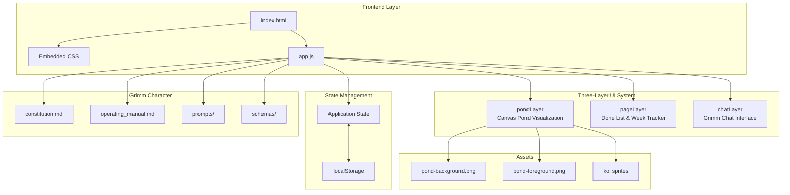
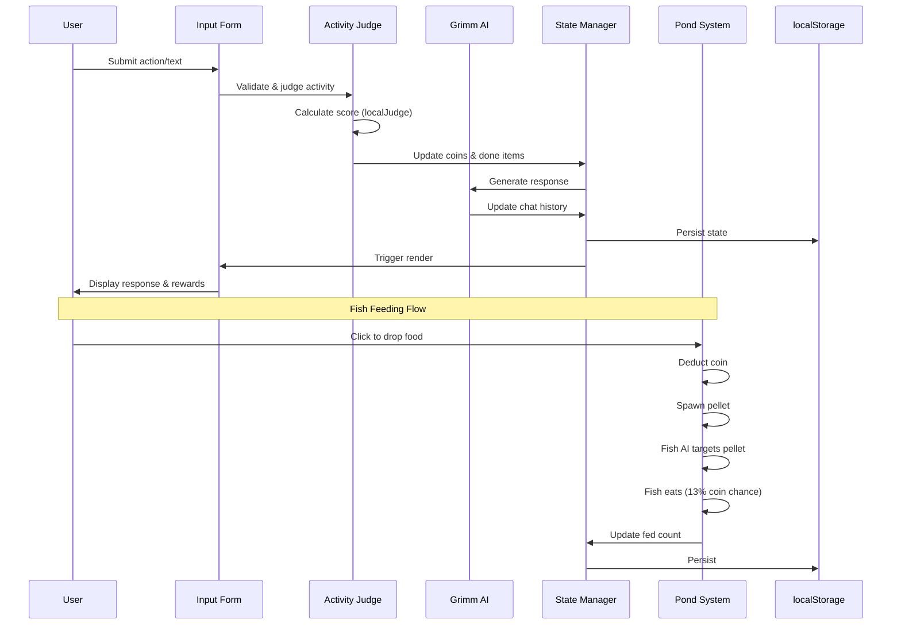

# Grimm App Architecture Diagram

## High-Level Architecture



## Data Flow Diagram



## Component Architecture

```mermaid
graph TB
    subgraph "Main Application (app.js)"
        INIT[Initialization]
        STATE_M[State Management]
        POND_SYS[Pond System]
        UI_SYS[UI System]
        CHAT_SYS[Chat System]
        JUDGE[Activity Judge]
        GRIMM[Grimm AI Logic]
    end
    
    subgraph "Pond System"
        KOI_CLASS[Koi Class]
        RENDER[Canvas Render Loop]
        PHYSICS[Fish Physics AI]
        FEED[Feeding Mechanic]
    end
    
    subgraph "UI System"
        LAYER[Layer Classes]
        RENDER_UI[Render Functions]
        WEEK[Week Tracker]
        DONE[Done List]
    end
    
    subgraph "Chat System"
        BUBBLE[Chat Bubbles]
        SEQUENTIAL[Sequential Display]
        QUICK[Quick Thread]
        DECISION[Decision Buttons]
    end
    
    subgraph "State Structure"
        BASE[Base State]
        CASE[Case File]
        GOALS[Goals]
        ITEMS[Done Items]
        CHAT_H[Chat History]
    end
    
    INIT --> STATE_M
    STATE_M --> POND_SYS
    STATE_M --> UI_SYS
    STATE_M --> CHAT_SYS
    STATE_M --> JUDGE
    STATE_M --> GRIMM
    
    POND_SYS --> KOI_CLASS
    POND_SYS --> RENDER
    POND_SYS --> PHYSICS
    POND_SYS --> FEED
    
    UI_SYS --> LAYER
    UI_SYS --> RENDER_UI
    UI_SYS --> WEEK
    UI_SYS --> DONE
    
    CHAT_SYS --> BUBBLE
    CHAT_SYS --> SEQUENTIAL
    CHAT_SYS --> QUICK
    CHAT_SYS --> DECISION
    
    STATE_M --> BASE
    STATE_M --> CASE
    STATE_M --> GOALS
    STATE_M --> ITEMS
    STATE_M --> CHAT_H
```



## State Structure Diagram

```mermaid
graph LR
    STATE[state]
    
    STATE --> COINS[coins: 120]
    STATE --> TROPHIES[trophies: 0]
    STATE --> GOALS[goals[]]
    STATE --> CROSSES[dayCrosses[]]
    STATE --> ITEMS[doneItems[]]
    STATE --> FED[fed: 0]
    STATE --> CHAT[chat[]]
    STATE --> CASE[caseFile]
    STATE --> AI[ai config]
    STATE --> FEEDBACK[feedback[]]
    STATE --> NOTEBOOK[notebook[]]
    STATE --> CODEX[codexTasks[]]
    
    CASE --> PROFILE[profile]
    CASE --> EVIDENCE[evidence[]]
    CASE --> THEORIES[theories[]]
    CASE --> RULES[adminRules[]]
    
    PROFILE --> TONE[tone]
    PROFILE --> LOOP[loop]
    PROFILE --> REWARD[rewardRule]
```

## Key Flows

### 1. Activity Logging Flow
```
User Input → Form Submit → 
  ├─ Simon Command? → Handle Admin
  ├─ Feedback? → Save Feedback
  ├─ Goal Detection? → Set Goal
  ├─ Conversation? → Grimm Reply
  └─ Activity? → Judge Activity → Award Coins → Check Goal → Trophy?
```

### 2. Pond Fish AI Flow
```
Fish Update Loop:
  ├─ Has Target Pellet? → Turn toward, speed up
  ├─ No Target? → Wander randomly
  ├─ Near Pellet? → Eat (13% coin drop)
  └─ Update position with wrapping
```

### 3. Chat State Flow
```
Chat States:
  minimized → Page visible, Quick bubbles
  maximized → Full chat, Page hidden
  keyboard → Mobile keyboard handling
```

### 4. Grimm Response Flow
```
User Message → 
  ├─ Show typing indicator
  ├─ Generate reply (local or AI)
  ├─ Split into segments
  ├─ Display sequentially with delays
  └─ Update chat history & state
```

## File Structure

```
Grimm App/
├── index.html              # Single HTML entry point
├── app.js                  # All application logic (1373 lines)
├── assets/                 # Visual assets
│   ├── pond-background.png
│   ├── pond-foreground.png
│   └── koi sprites
├── data/                   # JSON data files
│   ├── codex_tasks.json
│   ├── feedback.json
│   ├── notebook.json
│   └── player_memory.json
├── grimm/                  # Grimm character definition
│   ├── constitution.md     # Grimm's personality & rules
│   ├── operating_manual.md # AI provider instructions
│   ├── prompts/           # AI prompts
│   └── schemas/           # Data schemas
└── .gitignore             # Excludes server files
```

## Key Design Patterns

1. **Three-Layer Architecture**: pondLayer (bottom), pageLayer (middle), chatLayer (top)
2. **Local-First**: All data in localStorage, no backend required
3. **Character-Driven AI**: Grimm defined by constitution, not generic assistant
4. **Evidence-Based Rewards**: Coins for concrete actions, not vague chat
5. **Sequential Display**: Grimm responses split into segments for natural pacing
6. **Fish AI**: Autonomous koi with targeting, wandering, and feeding behaviors

## Technology Stack

- **Frontend**: Vanilla JavaScript, HTML5 Canvas
- **Styling**: Embedded CSS with CSS variables
- **Persistence**: localStorage
- **Deployment**: Static site (Vercel-ready)
- **AI**: Local judge (rule-based) with optional AI integration
